# Joyride

This program monitors the controllers connected to your Commodore 64 and displays relevant information. It supports a wide variety of controllers and adapters.

Joyride currently does not work on NTSC machines.

To test the keyboard, use the companion program [Anykey](https://github.com/T-Pau/Anykey).

The top left window displays the device connected to controller port 1, the top right window controller port 2. The bottom window displays the device connected to the user port.

You can use the function keys to select the correct controller type or to display raw data.

Adapters that support more than two controllers don't fit in the main screen. `F7` switches to a layout that supports four controllers per page.

For digital inputs, the button or direction is inverted when pressed. Analog inputs are displayed as numbers and by positioning a cursor.

## Loading the Program

Load the program from the disc image with `LOAD"*",8,1`. On C128 and MEGA65, switch to 64 mode before loading.

## Supported Devices

Controller Port:
- Joystick
- Mouse
- Paddle
- KoalaPad
- Light Pen (only in port 1)
- Protovision Protopad
- Trap Them Controller

User Port, Two Joysticks:
- Protovision / Classic Game Adapter
- Digital Excess / Hitmen
- Kingsoft
- Starbyte Tie Break Adapter
- PET Dual Joystick

User Port, One Joystick:
- PET Space Invaders+
- VIC-20 OEM
- C64DTV Hummer
- PETSCII Robots Adapter

Multi Adapters:
- SuperPAD 64
- Ninja SNED Pad
- Luigi Pantarotto's Spaceballs
- Inception
- MultiJoy
- Wheel of Joy
- Wheel of Joy Mini

Extra:
- NEOS Mouse
- Amiga Mouse
- Atari ST Mouse
- Atari CX-22 Trackball
- Atari CX-21 / CX-50 Keypad
- Atari CX-85 Keypad
- Cardco Cardkey 1
- Rushware Keypad
- Coplin Keypad

## Controller Port

The C64 has two controller ports. These support five digital lines that can be used as input or output, and two potentiometers that give values from 0 to 255.

Except for light pens and light guns, all devices can be connected to either port.

### Joystick

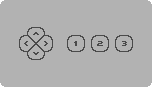

Joysticks contain a stick or d-pad with switches for the four cardinal directions and up to three buttons.

Buttons 2 and 3 bring an analog potentiometer to a low value by connecting its pin to +5V.

These potentiometers are also used by paddles and the 1351 mouse; if such a device is connected, the buttons may read as pressed.

### Mouse

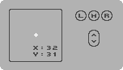

Supported are 1351 compatible mice. They give the position in x and y modulo 64 and support up to three buttons and a scroll wheel.

### Paddle

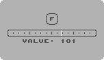

A paddle gives the rotational position of its knob as a value from 0 to 255. It also contains a button.

Two paddles can be connected to one port at the same time. They are displayed in two separate pages.

### KoalaPad

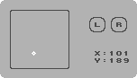

This is a touch tablet that gives the position in x and y as values from ca. 6 to 251. It also contains two buttons.

### Light Pen

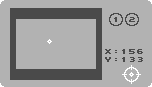

Light pens and light guns only work in controller port 1 and require a CRT monitor.

They point directly at a position on screen. This is indicated by a big cross-hair on screen, even if it's outside the display area of the port. It is also shown on a smaller representation of the screen.

They can have up to two buttons. Some pens require a button to be pressed for the position to register.

### Protovision Protopad

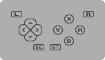

This is a SuperNES style controller that can emulate a regular joystick or all buttons can be read in native mode. 

This view displays the native mode. For emulation mode, use the Joystick view. 

It has these inputs:
- d-pad
- four face buttons (A, B, X, Y)
- two shoulder buttons (L, R)
- Select, Start

Note: Support for this controller has not been tested with real hardware.

### Trap Them Controller

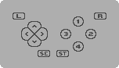

This is a SuperNES style controller with these inputs:
- d-pad
- four face buttons (1, 2, 3, 4)
- two shoulder buttons (L, R)
- Select, Start

### Raw

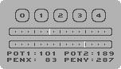

This view displays the five digital input lines, and the two analog potentiometers as values from 0 to 255.

For port 1, it also displays the light pen coordinates.

## User Port 

The C64 has a user port that allows it to interface with various hardware attachments.

### 4-Player Adapter

These adapters support two additional joysticks with four directional switches and one button each.

Supported are the following variants:
- Protovision / Classic Game Adapter
- Digital Excess / Hitmen
- Kingsoft
- Starbyte Tie Break Adapter

### PET Dual Joystick Adapter

This adapter from TFW8b is designed for the PET, but also works on the C64.

It supports two joysticks with four directional switches and one button each.

Due to technical limitations, up and down cannot be read while fire is pressed.

### PET Space Invaders+

This adapter is an extension of the Space Invaders adapter designed for the PET, which adds up and down.

It supports one joystick with four directional switches and one button.

### VIC-20 OEM

This adapter was designed for the VIC-20, but also works on the C64.

It supports one joystick with four directional switches and one button.

Note: Support for this adapter has not been tested with real hardware.

### C64DTV Hummer

This adapter was designed for the C64DTV, but also works on the regular C64.

It supports one joystick with four directional switches and one button.

Note: Support for this adapter has not been tested with real hardware.

### PETSCII Robots Adapter

This adapter is included with the game Attack of the PETSCII Robots and allows connecting one SuperNES controller or mouse to the userport.

The controller has these inputs:
- d-pad
- four face buttons (A, B, X, Y)
- two shoulder buttons (L, R)
- Select, Start

Mice display x/y and two buttons.

## Multi Adapters

These adapters support eight or more input devices. The type of devices depends on the adapter.

They connect to the user port, controller port, or both. 

Four controllers are displayed per page, from left to right, top to bottom. Use `F3`/`F4` to switch pages.

### SuperPAD 64 / Ninja SNES Pad

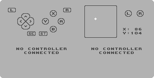

These adapters support eight Nintendo SuperNES controllers or mice. The types of connected devices are detected automatically.

SuperPAD 64 connects to the user port, Ninja SNES Pad connects to both controller ports.

Controllers have these inputs:
- d-pad
- four face buttons (A, B, X, Y)
- two shoulder buttons (L, R)
- Select, Start

Mice display x/y coordinates and two buttons.

The third page shows the raw data read from each controller.

### Luigi Pantarotto's Spaceballs

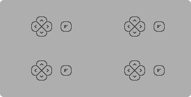

This adapter supports eight joysticks with one button each.

It connects to the user port and either controller port.

Note: Support for this adapter has not been tested with real hardware.

### Inception

This adapter supports eight joysticks with one button each.

It connects to either controller port.

PS/2 mice and auto-detection are not supported yet.

The third page shows the raw data read from the adapter.

### MultiJoy / Protovision MultiJoy

These adapter supports joysticks with one button each, depending on model 8 or 16 joysticks.

They connect to both controller ports. For the original variant, port 1 is used for control, port 2 for joysticks. The Protovision variant has the ports swapped.

Note: Support for the sixteen joystick variant has not been tested.

### Wheel of Joy

This adapter from SukkoPera is designed for the Plus/4, but also works on the C64.

It supports eight joysticks with one button each.

It connects to the user port through an adapter cable.

### Wheel of Joy Mini

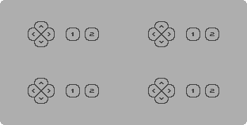

This adapter from SukkoPera is designed for the Plus/4, but also works on the C64.

It supports four joysticks with two buttons each.

It connects to the user port through an adapter cable.

Note: Support for this adapter has not been tested. 

## Extra

These devices don't fit in the regular controller port window or block parts of the keyboard and are therefore collected in the extra view.

While they work in both controller ports, Joyride only supports them in port 1.

### NEOS Mouse

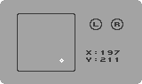

This mouse give the position in x and y modulo 256 and supports two buttons.

Due to technical limitations, mouse movement can't be read while the left button is pressed.

Note: Support for this mouse has not been tested with real hardware.

### Amiga Mouse

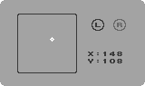

This mouse displays x/y and two buttons.

The right mouse button can't be read on a Commodore 64.

### Atari ST Mouse

This mouse displays x/y and two buttons.

The right mouse button can't be read on a Commodore 64.

### Atari CX-22 Trackball

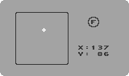

This trackball displays x/y and one button.

### Atari CX-21 / CX-50 Keypad

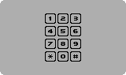

This keypad contians 12 keys.

### Atari CX-85 Keypad

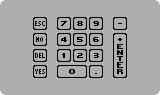

This keypad contains 17 keys.

Due to technical limitations, multiple simultaneous key presses cannot be read and might register as a different key.

### Cardco Cardkey 1

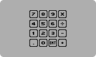

This keypad contains 16 keys.

Due to technical limitations, multiple simultaneous key presses cannot be read and might register as a different key.

Note: Support for this keypad has not been tested with real hardware.

### Rushware Keypad

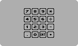

This keypad contains 16 keys.

Due to technical limitations, multiple simultaneous key presses cannot be read and might register as a different key.

Note: Support for this keypad has not been tested with real hardware.

### Coplin Keypad

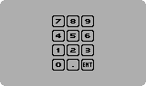

This keypad contains 12 keys.

Due to technical limitations, multiple simultaneous key presses cannot be read and might register as a different key.

Note: Support for this keypad has not been tested with real hardware.
