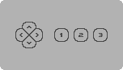
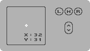
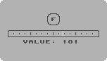
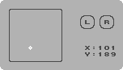
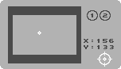
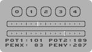

# Joyride

This program monitors the controllers connected to your c64 and displays relevant information. It supports a wide variety of controllers and adapters.

To test the keyboard, use the companion program [Anykey](https://github.com/T-Pau/Anykey).

The top left window displays the device connected to controller port 1, the top right window controller port 2. The bottom window displays the device connected to the user port.

You can use the function keys to select the correct controller type or to display raw data.

Adapters that support more than two controllers don't fit in the main screen. `F7` switches to a layout that supports four controllers per page.

For digital inputs, the button or direction is inverted when pressed. Analog inputs are displayed as numbers and by positioning a cursor.

## Supported Devices

Controller Port:
 - Joystick
 - Mouse
 - Paddle
 - Koalapad
 - Light Pen (only in port 1)
 - Protovision Protopad
 - Trap Them Controller

Userport:
 - Protovision / Classic Game Adapter
 - Digital Excess / Hitmen
 - Kingsoft
 - Starbyte Tie Break Adapter
 - PETSCII Robots Adapter

Multi Player Adapters:
- SuperPAD 64
- Ninja SNED Pad
- Luigi Pantarotto's Spaceballs
- Inception
- MultiJoy

## Controller Port

The C64 has two controller ports. These support five digital lines that can be used as input or output, and two potentiometers that give values from 0 to 255.

Except for light pens and light guns, all devices can be connected to either port.

### Joystick

Joysticks contain a stick or d-pad with switches for the four cardinal directions and up to three buttons.

Buttons 2 and 3 bring an analog potentiometer to a low value by connecting its pin to +5V.

These potentiometers are also used by paddles and the 1351 mouse; if such a device is connected, the buttons may read as pressed.

### Mouse

Supported are 1351 compatible mice. They give the position in x and y modulo 64 and support up to three buttons and a scroll wheel.

### Paddle

A paddle gives the rotational position of its knob as a value from 0 to 255. It also contains a button.

Two paddles can be connected to one port at the same time. They are displayed in two separate pages.

### Koalapad

This is a touch tablet that gives the position in x and y as values from ca. 6 to 251. It also contains two buttons.

### Light Pen

Light pens and light guns only work in controller port 1 and require a CRT monitor to work.

They point directly at a position on screen. This is indicated by a big cross-hair on screen, even if it's outside the display area of the port. It is also shown on a smaller representation of the screen.

They can have up to two buttons. Some pens require a button to be pressed for the position to register.

### Protopad

This is a SuperNES style controller that can emulate a regular joystick or all buttons can be read in natvie mode. 

This view displays the native mode. For emulation mode, use the Joystick view. 

It has these inputs:
- d-pad
- four face buttons (A, B, X, Y)
- two shoulder buttons (L, R)
- Select, Start

Note: Support for this adapter has not been tested with real hardware.

### Trap Them Controller

This is a SuperNES style controller with these inputs:
- d-pad
- four face buttons (1, 2, 3, 4)
- two shoulder buttons (L, R)
- Select, Start

### Raw

This view displays the five digital input lines, and the two analog potentiometers as values from 0 to 255.

For port 1, it also displays the light pen coordinates.

## Userport 

The C64 has a user port that allows it to interface with various hardware attachments.

### 4-Player Adapter

These adapters support two additional joysticks with four directional switches and one button each.

Supported are the following variants:
- Protovision / Classic Game Adapter
- Digital Excess / Hitmen
- Kingsoft
- Starbyte Tie Break Adapter

### PETSCII Robots Adapter

This adapter is included with the game *Attack of the PETSCII Robots* and allows connecting one SuperNES controller to the User Port.

It has these inputs:
- d-pad
- four face buttons (A, B, X, Y)
- two shoulder buttons (L, R)
- Select, Start

## Multi Player Adapters

These adapters support eight or more input devices. The type of devices depends on the adapter.

The connect to the user port, controller port, or both. 

Four controllers are displayed per page. Use `F3`/`F4` to switch pages.

### SuperPAD 64 / Ninja SNES Pad

These adapters support eight Nintendo SuperNES controllers or mice. The types of connected devices are detected automatically.

SuperPAD 64 connects to the user port, Ninja SNES Pad connects to both controller ports.

Controllers have these inputs:
- d-pad
- four face buttons (A, B, X, Y)
- two shoulder buttons (L, R)
- Select, Start

Mice display x/y coordinates and two buttons.

The third page shows the raw data read from each controller.

### Luigi Pantarotto's Spaceballs

This adapter supports eight joysticks with one button each.

It connects to the user port and either controller port.

Note: Support for this adapter has not been tested with real hardware.

### Inception

This adapter supports eight joysticks with one button each.

It connects to either controller port.

PS/2 mice and auto-detection are not supported yet.

The third page shows the raw data read from the adapter.

### MultiJoy

This adapter supports eight or sixteen joysticks with one button each.

It connects to both controller ports.

Note: Support for the sixteen joystick variant has not been tested.
