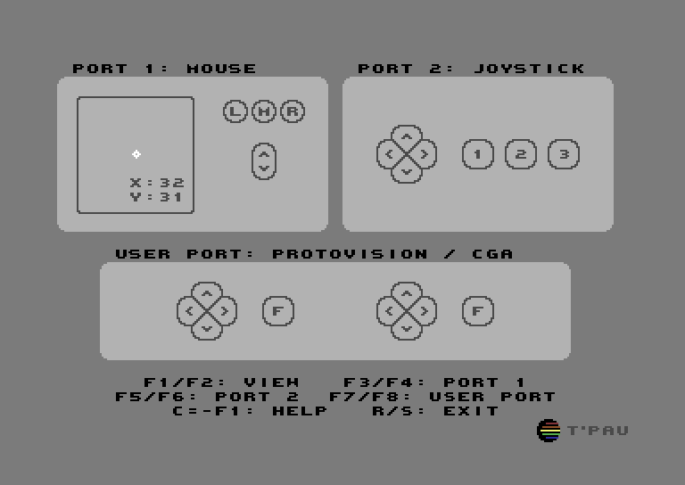

# Joyride

This program monitors the controllers connected to your C64 and displays relevant information depending on their types. You can use the function keys to select the correct type or to display raw data.

Adapters that support more than two controllers don't fit in the main screen. `F7` switches to a layout that supports four controllers per page.

For digital inputs, the button or direction is inverted when pressed. Analog inputs are displayed as numbers and by positioning a cursor.

## Supported Devices

The following devices are supported:

Controller port:

- Joystick
- Mouse
- Paddle
- Koalapad
- Light Pen (only in port 1)
- Ninja SNES Pad / Trap Them

Userport:

- Protovision / Classic Game Adapter
- Digital Excess / Hitmen
- Kingsoft
- Starbyte Tie Break Adapter
- SuperPad64

## Joystick

Joysticks contain a stick or d-pad with switches for the 4 cardinal directions and up to three buttons.

Buttons 2 and 3 bring an analog potentiometer to a low value by connecting its pin to +5V.

## Mouse

Supported are 1351 compatible mice. They give the position in X and Y modulo 64 and support up to three buttons and a scroll wheel.

## Paddle

A paddle gives the rotational position of its knob as a value from 0 to 255. It also contains a button.

Two paddles can be connected to one port at the same time.

## Koalapad

This is a touch tablet that gives the position in X and Y as values from ca. 6 to 251. It also contains two buttons.

## Light Pen

Light pens and light guns only work in controller port 1.

They point directly at a position on screen. This is indicated by a big cross hair on screen, even if it's outside the display area of the port. It is also shown on a smaller representation of the screen.

They can have up to two buttons. Some pens require a button to be pressed for the position to register.

## Raw Data

This displays the 5 digital input lines, and the two analog potentiometers as values from 0 to 255.

For port 1, it also displays the light pen coordinates.

## Userport Joystick Adapter

These adapters support two additional joysticks with four directional switches and one button each.

Supported are the following variants:

- Protovision / Classic Game Adapter
- Digital Excess / Hitmen
- Kingsoft
- Starbyte Tie Break Adapter

## SuperPad64 / Ninja SNES Pad

These adapters support eight Nintendo SuperNES controllers.

SuperPad64 connects to the userport. Ninja SNES Pad connects to both controller ports.

All inputs are supported:

- dpad
- four buttons (A, B, X, Y)
- two shoulder buttons (L, R)
- Select, Start

Four controllers are displayed per page.

A Trap Them controller in port 1 is compatible with the SNES Pad.

# Building Joyride

Joyride is written in CC65 assembler. To build it, you need [cc65](https://cc65.github.io) and `make`.

The graphics are drawn in [Affinity Photo](https://affinity.serif.com/en-gb/photo/) and converted with a custom, as yet unreleased, program and a [Python](https://www.python.org/) script. If you want to work on them, please contact me.

